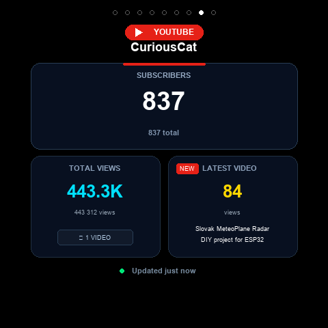

# MeteoPlaneRadar (Tactical & Precipitation Weather Radar for ESP32-S3)


**Multifunctional weather station, live ADS-B flight radar, animated precipitation radar (SHMÚ, ČHMÚ, RainViewer), combined tactical radar, ISS orbit tracking, YouTube channel analytics, financial market tickers, and animated pixel-art virtual pet companion on a round 2.1" IPS touchscreen.**  
Designed specifically for the **Waveshare ESP32-S3-Touch-LCD-2.1** development board with modern smartphone-like touch gestures, a pull-down Control Center, live aircraft photos, bilinear radar smoothing, and a responsive web dashboard for remote control and complete configuration.

> 🇸🇰 Slovenská dokumentácia: **[README_SK.md](README_SK.md)**  
> 📌 Forked and significantly enhanced from the original project **[petus/MeteoPlaneRadar](https://github.com/petus/MeteoPlaneRadar)**.

---

## 📸 Live Device Demo

<p align="center">
  
  
  
  
  
  
</p>

<p align="center">
  <em>From left to right: <b>Tactical Radar</b>, <b>ISS Orbit Tracker</b> (day/night terminator, past/future orbits, footprint ring), <b>Markets & Crypto</b> (custom tickers & sparkline), <b>Aircraft Detail</b>, <b>Weather Radar</b>, <b>Stacked Bold Watch Face</b>.</em>
</p>

### 🐱 DigiCat Animated Pixel Art Companion

<p align="center">
  
  
  
  
  
  
  
</p>

<p align="center">
  <em>DigiCat handcrafted 32-frame pixel art: <b>Walk Cycle</b>, <b>Pounce Leap</b>, <b>Face Grooming</b>, <b>Yoga Stretch</b>, <b>Purr & Blush</b>, <b>Fish Snack</b>, <b>Sleeping Loaf</b>.</em>
</p>

---

## 🌟 Implemented Features

### 🕒 1. Collection of 6 Unique Clock Faces
The round 480×480 display features **6 completely distinct geometry styles** with smooth vertical swipe switching:
1. **Stacked Bold Typography** – Contemporary smartwatch aesthetic with giant stacked hours `HH` and minutes `MM` flanked by rounded capsule badges for weather, moon, date, and wind.
2. **Aviator Cockpit Analog** – Authentic pilot dial with luminous tapered hands, hour chapter ring, and two sub-dials (weather at 9 o'clock, moon phase at 3 o'clock).
3. **🚀 Orbital Gauges** – Futuristic sci-fi face with three concentric circular arcs (minutes, hours, seconds) with glowing tip markers and a central telemetry hub.
4. **⏱️ Observatory Régulateur Chrono** – High-horology regulator chronometer with decoupled axes: full-diameter master minute hand, separate upper hour sub-dial (at 12:00), separate lower second sub-dial (at 6:00), and side complications.
5. **Nordic Minimal** – High-contrast, clean minimalist time easily readable across the room.
6. **Classic Digital** – Clean horizontal `HH:MM` layout with u8g2 font, date, centered weather condition icon, 3-hour forecast pills, wind, and moon phase.

- **Solar Arc with Sun Rays**: Realistic 24-hour astronomical sun position arc with radiant solar rays, gold day arc, blue night arc, and exact sunrise/sunset milestones.

### ⏱️ 2. Outer Seconds Ring Customization
**7 distinct perimeter seconds styles**:
- `Off` (clean bezel), `Dot` (orbiting pip), `Smooth Arc` (filling neon ring), `Pulse` (breathing halo), `Radar Sweep` (rotating radar beam), `Swiss Ticks` (60 indices), `Orbital Satellite` (satellite tracking the bezel).

### 🛩️ 3. Advanced Aircraft Tracking & Intelligent Alert HUD
- **360° Airspace Surveillance:** Tracks live flight traffic within a 14–200 km radius via adsb.fi / adsb.lol.
- **Special Flight Recognition:** Rescue helicopters (green), VIP/Government flights (gold), Iconic heavy aircraft (cyan), and Military sorties (red) are automatically detected and highlighted with glowing target rings.
- **Top Alert Banner:** Displays live alerts for special flights within range (e.g. `! Rescue Helicopter: ATE02 (18 km) !`).
- **Emergency Squawk Auto-Focus (7500, 7600, 7700):** If an aircraft transmits an emergency code, all other flights are dimmed, the map smoothly locks onto and follows the aircraft, and a live telemetry banner displays altitude, ground speed, and vertical rate.
- **Proximity Vector:** Real-time vector line pointing directly to the nearest aircraft with distance, bearing, and altitude delta.
- **Airports & Route Database:** Nearby airports plotted on the radar with offline callsign route decoding (e.g., `Burgas -> Warsaw [BOJ>WAW]`).

### 🔍 4. Aircraft Detail Card with Live High-Res Photos
- Tap any aircraft icon on the radar to open a detailed color-coded telemetry card.
- Live aircraft photography fetched on-demand from the **Planespotters.net API**.
- Tap the photo to view it full-screen on the round 480×480 display.

### 🌧️ 5. Animated Precipitation Radar (SHMÚ, ČHMÚ, RainViewer)
- High-resolution precipitation composite loops with temporal cross-dissolve between radar frames.
- 256 kB external PSRAM buffers per composite ensuring uninterrupted display even during severe widespread storm fronts.
- Optional bilinear anti-aliasing / smoothing filter for smooth, organic radar contours.

### ⚡ 6. Approaching Precipitation Nowcasting (TREC) & Dynamic Typing
- **2D Vector Nowcasting:** Real-time 2D spatial cross-correlation tracking precipitation velocity and trajectory. Alerts strictly when rain or storms are heading towards your location ($v_{radial} > 0$, miss distance $\le 6\text{ km}$, $\text{ETA} \le 35\text{ min}$) with ground clutter and virga filtering.
- **Dynamic Precipitation Typing:** Automatically classifies incoming precipitation into **Rain**, **Sleet** ($1^\circ\text{C}\dots3^\circ\text{C}$), **Snow** ($\le 1^\circ\text{C}$), or severe **Hail** ($>50\text{ dBZ}$) using radar reflectivity and local temperature telemetry.
- **Clock Face Alert Widget:** Displays an alert pill on the clock screen with tap-to-radar navigation.

### 🛰️ 7. Combined Tactical Radar (`ScreenTactical`)
- Simultaneous real-time overlay of **animated precipitation radar tiles in the background** with **live ADS-B aircraft traffic in the foreground** on a single unified tactical screen.

### 🌤️ 8. 3-Day Weather Forecast & Air Quality
- Hourly temperature, precipitation probability, and wind speed curves powered by Open-Meteo.
- 3-day weather overview, Air Quality Index (AQI), PM2.5, and European pollen count.

### 📈 9. Financial Markets & Crypto Tracker (`ScreenFinance`)
- Real-time financial telemetry powered by Yahoo Finance v8 API.
- **4 Custom Asset Slots**: Configurable for European ETFs (Amundi MSCI World, Stoxx Europe 600), US indices, commodities (Gold, Crude Oil), equities, cryptocurrencies, and Forex currency pairs.
- **On-Device Asset Picker**: Select any tracked slot directly from the pull-down Quick Control drawer with 34 popular presets across 6 categories.
- **Line & Candlestick Charts**: Toggle between continuous sparkline trendlines and authentic colored trading candlesticks (emerald bullish, coral bearish, wicks for High/Low, bodies for Open/Close).
- Tap rows to select focused asset, double-tap to trigger immediate refresh.

### 🛰️ 10. ISS Orbit Tracker (`ScreenIss`)
- **Astronomical Day/Night World Map**: High-contrast 320×160 equirectangular world map with real-time solar terminator day/night shading.
- **Orbit Ground Track**: Past trajectory (45-min dashed path) and forward predicted ground track (92-min solid amber curve).
- **Line-of-Sight Footprint**: Radio/visual horizon ring (~2,200 km range) around the ISS with observer reticle.
- **Telemetry HUD**: Live altitude, velocity, slant distance, next pass countdown, and peak elevation prediction.
- **Acoustic Proximity Ping**: Sonar ping (`BEEP_SONAR_PING`) when the ISS enters visible range.

### ▶️ 11. YouTube Channel Analytics (`ScreenYouTube`)
- **Live Channel Metrics**: Real-time subscriber count, total channel view count, and latest video upload stats powered by official YouTube Data API v3.
- **High-Impact Typography**: Prominent subscriber number rendered with custom bold vector font (`FONT_HERO`, 32 px).
- **Dual Telemetry Cards**: Symmetrically balanced split cards displaying Total Views (cyan) with video count badge, and Latest Video (gold) with NEW indicator and word-wrapped video title.
- **On-Demand & Background Polling**: Instant refresh on screen tap with acoustic feedback; background polling respects quota limits.

### 📊 12. Zero-Reset Multi-Scope Flight Statistics (`ScreenInfo`)
- Tracks 24-hour airspace activity across **6 independent zoom scopes** (ALL, $\le 10\text{ km}$, $\le 25\text{ km}$, $\le 50\text{ km}$, $\le 100\text{ km}$, $\le 200\text{ km}$) computed in parallel in PSRAM.
- Tap the traffic card header to cycle scopes on the fly with **zero data loss or reset**.
- Tracks unique aircraft count, top speed record with callsign, maximum detection distance with callsign, altitude flight level span (FL min/max), and total ADS-B reports received.
- Resets automatically at midnight or via manual button on screen / web dashboard.

### 🔊 13. Active Buzzer Acoustic Alert System
- Onboard active buzzer integration for emergency squawks (7700/7600/7500), watched aircraft entry, overhead passes, approaching storm alerts, sonar pings, hourly chimes, touch clicks, and automatic night-time muting.

### 🌙 14. Ultra Night Mode & Ambient Display Control
- **Deep-Red Night Mode**: Monochromatic deep-red sleep mode running at ultra-low backlight brightness (0.5%) to preserve dark-adapted vision.
- **Night Clock Only Mode (`nightClockOnly`):** Automatically stops screen cycling during sleep hours and locks the display dimmed onto the Clock face.

### 📱 15. Quick Control Center & Smart Gestures
- Pull-down drawer from top edge for instant control of brightness, night mode, buzzer mute, legend toggle, and screen cycling.
- Smartphone-like touch gestures: horizontal swipes for screen transitions, vertical swipe for watchface style and radar zoom.

### 🕒 16. Hardware RTC (PCF85063) & Power Independence
- Automatic boot and network NTP synchronization with the onboard PCF85063 real-time clock.
- Supports soldering a **3.3V 1.0F–1.5F supercapacitor** to the `BAT` and `GND` pads for battery-free timekeeping during power outages.

### 🖥️ 17. Rock-Solid ST7701 Display Driver (Zero Drift)
- Calibrated 8 MHz RGB pixel clock with factory timing porches (`HBP 10`, `HFP 50`, `VPW 8`, `VBP 8`, `VFP 8`), 4 MHz SPI init, and deferred display enablement.
- **Zero-Drift Architecture**: Eliminated SPI Flash writes during automatic screen cycling (carousel), preventing cache stalls and GDMA FIFO starvation.
- Automatic VSYNC recovery (`CONFIG_LCD_RGB_RESTART_IN_VSYNC`) and on-demand resync endpoint (`/api/display/resync`).

### ⚡ 18. Robust Dual-Core FreeRTOS Architecture
- **Core 1:** Dedicated to ST7701 RGB rendering (double-framebuffer, zero flicker), CST820 capacitive touch, and UI animations.
- **Core 0 (`AsyncNetWorker`):** Non-blocking background worker handling mbedTLS handshakes, radar tile caching, ADS-B JSON parsing, and HTTP web serving with cooperative dual-core network arbitration.

### 🌐 19. Comprehensive Web Dashboard & Zero-Fail OTA
- Complete device configuration, screen switching, and remote controls.
- Live telemetry tables for ADS-B flights and ISS status.
- Real-time web serial monitor (64 KB PSRAM ring buffer) over Wi-Fi without USB cables.
- Remote uncompressed 24-bit BMP screenshot capture tool.
- **Zero-Fail OTA**: Proactive PSRAM cache reclamation (>6 MB freed) and automatic direct-to-flash streaming fallback.

### 🔌 20. Smart Home REST API
- Direct JSON REST endpoints for Home Assistant, Node-RED, or scripts (`/api/status`, `/api/hardware`, `/api/screen`, `/api/display/resync`, `/api/toggle-legends`, `/api/rtc/sync_ntp`).

### 🐾 21. Interactive Pixel Art Companion & Autonomous DigiCat
- Full-screen interactive companion drawer accessible from any screen via **Swipe Up** from the bottom edge or the Quick Control Center paw icon.
- **Handcrafted 32-Frame Pixel Art Animation Engine**:
  - Crisp 16-color retro palette (RGB565) scaled 2× (128×128 px) via run-length span blitter (< 0.5 ms render time).
  - Authentic ginger tabby with "M" forehead pattern, white bib, pink pads, emerald eyes, and swishing tail.
  - **9 Animation Sequences**: Walk Cycle (4 frames with bidirectional horizontal flipping), Sitting Idle with breathing & blinking (4 frames), Affectionate Purr & blushing (4 frames), Aircraft Tracking (2 frames), Snack Munching (4 frames), Night Sleeping Loaf with Zzz (4 frames), Pounce Leap (4 frames with vertical jump arc), Paw Face Wash Grooming (4 frames), and Yoga Stretch (2 frames).
- **Autonomous AI Cat Brain & Free Will**:
  - **Randomized Multi-Side Entrance**: Trots in from either the left or right edge upon opening the drawer.
  - **Active Idle Exploration**: Autonomously cycles between deck strolls, playful pounces, face washing, and stretching every 6–12 seconds.
  - **Airfield Excursions**: DigiCat can decide to leave the screen on hangar patrol or moth chasing, leaving behind a radar blip and status note.
  - **Return When Called**: Tapping anywhere on screen, clicking Feed/Pet, or tapping the chassis instantly summons DigiCat back with energetic trot, cheerful meow chirp, and joyful greeting.
- **Virtual Pet Mechanics & Aviation Progression**:
  - Live Happiness (0–100%) and Hunger (0–100%) gauges on the HUD.
  - Real-time aircraft tracking XP unlocks aviation ranks: *Kitten Cadet* → *Radar Navigator* → *Airspace Ace*.
- **Google Gemini Live AI**:
  - Optional Google Gemini Flash integration with dynamic auto-model discovery for live contextual thoughts on surrounding air traffic and weather, with 100% offline fallback in Slovak, Czech, and English.
- **Attribution**: Transparently inspired by and credited to [aquascape123/digicat](https://github.com/aquascape123/digicat) under the MIT License.

---

## 📱 Screen Overview

| Screen | Preview | Description | Data Source |
| :--- | :---: | :--- | :--- |
| **0. Clock** |  | 6 selectable watchfaces (Stacked Bold, Aviator, Orbital, Régulateur, Nordic Minimal, Classic Digital), forecast pills, weather, moon phase, solar arc with rays | Open-Meteo & Astro Engine |
| **1. Planes** |  | 360° airspace tracking, emergency squawks (7700/7600), airline routes, airport beacons, range rings | adsb.fi / adsb.lol |
| **1b. Aircraft Detail** |  | Tap any aircraft to reveal full telemetry, route origin/destination, and high-res aircraft photography | Planespotters.net API |
| **2. Weather Radar** |  | Animated precipitation radar loop with smooth cross-dissolve, reflectivity scale, and city markers | SHMÚ (SK), ČHMÚ (CZ), RainViewer |
| **3. Tactical Radar** |  | **Combined tactical view:** Live precipitation radar + ADS-B flights overlay on a single screen | SHMÚ / ČHMÚ / RainViewer + adsb.fi |
| **4. Forecast** |  | Hourly temperature, wind, and rain curves, 3-day forecast, Air Quality (AQI), PM2.5, and pollen count | Open-Meteo Weather & Air Quality |
| **5. Markets & Crypto** |  | Real-time tracking of 4 customizable market tickers (ETFs, Stocks, Commodities, Crypto, Forex) with interactive sparkline / candlestick charts | Yahoo Finance v8 |
| **6. ISS Orbit Tracker** |  | Global equirectangular world map with real-time day/night solar terminator, past/future orbits, footprint ring, next pass countdown | WhereTheISS API |
| **7. YouTube Analytics** |  | Live channel analytics: subscriber count (large bold typography), total channel views, and latest video upload stats | YouTube Data API v3 |
| **8. Air Traffic Stats** |  | Daily 24h airspace activity: unique aircraft count, speed record, altitude span, max range, ADS-B reports across 6 zoom scopes | FreeRTOS PSRAM Tracker |
| **9. Settings** |  | Device telemetry, IP address, brightness slider, map orientation, radar smoothing, language selector | System |

---

## 🔑 How to Get a Free YouTube Data API Key

The YouTube Analytics screen connects to the official **Google YouTube Data API v3** to fetch live subscriber numbers, total view counts, and latest video statistics. Follow these simple steps to obtain your free API key:

### Step 1: Create a Google Cloud Project
1. Go to the **[Google Cloud Console](https://console.cloud.google.com/)** and sign in with your Google account.
2. Click the project dropdown at the top of the page and select **New Project**.
3. Name your project (e.g. `MeteoPlaneRadar`) and click **Create**.

### Step 2: Enable the YouTube Data API v3
1. In the search bar at the top, type `YouTube Data API v3` and select it from the results.
2. Click the blue **Enable** button.

### Step 3: Create Credentials (API Key)
1. Go to **APIs & Services** > **Credentials** from the left navigation menu.
2. Click **+ CREATE CREDENTIALS** at the top and choose **API key**.
3. Your new API key will be generated instantly (starts with `AIzaSy...`). Copy this key.
   *(Optional but recommended: Click "Edit API key" and restrict it under "API restrictions" to "YouTube Data API v3").*

### Step 4: Find Your YouTube Channel Identifier
You can use either:
- **Channel Handle**: The `@name` of the channel (e.g., `@CuriousCatFPV` or `@MKBHD`).
- **Channel ID**: A 24-character string starting with `UC...` found under YouTube Studio > Customization > Basic Info.

### Step 5: Configure on Your MeteoPlaneRadar
1. Open your device's web dashboard at `http://meteoplaneradar.local/`.
2. Scroll to the **YouTube** tab.
3. Paste your **API Key** and enter your **Channel Handle / ID**.
4. Click **Save Settings**. The device will immediately query the API and populate the YouTube screen!

---

## 🖐️ Gesture & Touch Controls

| Gesture / Action | Action |
| :--- | :--- |
| **Swipe Left / Right** | Transitions smoothly to the next / previous screen with slide animation. |
| **Pull Down from Top Edge** | Opens the **Quick Control Center** (brightness, night mode, screen toggles, asset picker). |
| **Swipe Up from Bottom Edge** | Pulls up the **DigiCat Virtual Pet Companion Drawer**. |
| **Within Pet Drawer** | **Tap Pet:** Pet / show affection (instant purr/bark dialogue, blush, bounce).<br>**Double-Tap:** Feed treat snack (golden fish cracker, restores hunger & happiness).<br>**Swipe Down / Tap Header:** Closes the drawer. |
| **Swipe Up / Down in Center** | **On Clock:** Cycles to previous / next watchface style.<br>**On Radars:** Zoom In (swipe up) / Zoom Out (swipe down).<br>**On Control Center:** Closes the overlay. |
| **Tap Bottom Range Bar** | Left half zooms Out, right half zooms In. |
| **Tap on Aircraft** | Opens full color-coded aircraft telemetry detail card with live photo. |
| **Tap on Aircraft Photo** | Enlarge aircraft photo to full screen (tap anywhere to return to card). |
| **Tap on YouTube Screen** | Triggers an immediate refresh of subscriber and video metrics with audio chime. |
| **Double-Tap (Knock on chassis / desk)** | **On Radars:** Toggles Clean Map Mode (hides legends).<br>**On Markets / ISS:** Forces immediate live data refresh. |
| **Hold BOOT button at startup (~3 s)** | Factory Reset (clears stored Wi-Fi and NVS settings). |

---

## 🔧 Hardware Specifications

Built specifically for the **[Waveshare ESP32-S3-Touch-LCD-2.1](https://www.waveshare.com/esp32-s3-touch-lcd-2.1.htm)**:

| Component | Specification |
| :--- | :--- |
| **MCU** | Espressif ESP32-S3R8 (Xtensa® Dual-Core 32-bit LX7 @ 240 MHz) |
| **Memory** | 8 MB Octal PSRAM + 16 MB Quad SPI Flash |
| **Display** | Round 2.1" IPS, 480×480 px, 65k RGB565 colors, ST7701 RGB interface |
| **Touch** | CST820 / CHSC6540 Capacitive Touch Controller (I2C) |
| **I/O Expander** | TCA9554PWR (Controls display power, backlight & reset) |
| **IMU Sensor** | QMI8658 6-axis Accelerometer & Gyroscope (tap & orientation detection) |
| **RTC Chip** | PCF85063 Real-Time Clock with low-power battery backup (I2C `0x51`) |
| **Connectivity** | USB-C (power + native CDC serial), Wi-Fi 802.11 b/g/n (2.4 GHz) |

---

## 🚀 Installation & Flashing

### Method A: Web Flasher / Pre-Built Binaries (Easiest)
Download the latest pre-compiled binary from the [Releases](https://github.com/hackra76/ESP-MeteoPlaneRadar/releases) page:
- `MeteoPlaneRadar-v1.9.9-factory.bin` (Complete single-binary image including bootloader, partitions, and firmware).
- Flash directly in your browser using the [ESP Web Flasher](https://espressif.github.io/esptool-js/) at baud rate 921600 starting at address `0x00000000`.

Or flash via command line using `esptool.py`:
```bash
esptool.py -p COM_PORT -b 921600 --before default_reset --after hard_reset write_flash 0x0 MeteoPlaneRadar-v1.9.9-factory.bin
```

### Method B: Build and Flash via PlatformIO
1. Open the project folder in **Visual Studio Code** with the **PlatformIO IDE** extension.
2. Connect the board via USB-C.
3. Run the following commands:
   ```bash
   # Build firmware
   pio run

   # Upload to device
   pio run -t upload
   ```

---

## 📶 Wi-Fi Configuration & First Boot

1. On first boot, the device creates an open Wi-Fi network named **`MeteoPlaneRadar`** and displays a QR code.
2. Scan the QR code or connect your phone/laptop to the `MeteoPlaneRadar` Wi-Fi.
3. Navigate to **`http://192.168.4.1/`**.
4. Select your home network, enter the Wi-Fi password, and click Save.
5. The device connects to your Wi-Fi and displays its assigned local IP address.

### Web Dashboard
Once connected, open the dashboard in your web browser:
- **`http://meteoplaneradar.local/`** (or via its IP address, e.g., `http://192.168.0.2/`).

The web interface features:
- **Location:** Automatic GeoIP detection or custom city/GPS coordinates.
- **Clock Styles & Aesthetics:** Choose watchface, seconds ring, and primary colors.
- **Radar Settings:** Select radar source (SHMÚ / ČHMÚ / RainViewer), toggle bilinear smoothing, airports, and flight trails.
- **YouTube Analytics:** Enter YouTube Data API v3 key and Channel Handle/ID.
- **Markets & Crypto:** Customize 4 stock/crypto ticker symbols and toggle candlestick chart mode.
- **Night Clock Only Mode (`nightClockOnly`):** Stops screen auto-rotation during the night and locks the display dimmed onto the clock.
- **Hardware Diagnostics & Web Serial Monitor:** Real-time web serial console (64 KB PSRAM ring buffer) over Wi-Fi without USB cables, RTC status, and manual time sync buttons.
- **Remote Control:** Switch screens and change radar range remotely from your browser.
- **OTA Updates:** Upload new `.bin` firmware builds wirelessly without plugging into USB.

---

## 🌐 REST API for Smart Home Automation

Integrate easily with **Home Assistant**, **Node-RED**, or terminal scripts via JSON REST endpoints:

- `GET /api/status` – Full JSON status (weather, aircraft counts, free heap, uptime, ISS).
- `GET /api/hardware` – Hardware peripherals, RTC clock, I2C bus scan, and last reset reason.
- `POST /api/screen` – Change screen: `{"index": 0}` (0: Clock, 1: Planes, 2: Weather, 3: Tactical, 4: Forecast, 5: Finance, 6: ISS, 7: YouTube, 8: Stats, 9: Settings).
- `POST /api/display/resync` – Force immediate hardware display resynchronization without reboot.
- `POST /api/toggle-legends` – Trigger a clean mode toggle.
- `POST /api/rtc/sync_ntp` – Trigger immediate RTC synchronization with NTP.

---

## 📜 License & Credits

Distributed under the **MIT License**.
- Original base project: **[petus/MeteoPlaneRadar](https://github.com/petus/MeteoPlaneRadar)**.
- Virtual pet vector mechanics, sleeping cat poses, and pet stat dynamics: **[aquascape123/digicat](https://github.com/aquascape123/digicat)** by aquascape123 (MIT License).
- Enhancements, Slovak localization, SHMÚ radar integration, bilinear anti-aliasing, Planespotters aircraft photos, tactical combined radar, expanded watchfaces, RTC driver, IMU gestures, touch navigation, Quick Control Center, YouTube Analytics screen, ISS orbit tracker, flight watchlist, AI Pet Companion, and multi-core stabilization: **Rado & Antigravity AI**.
