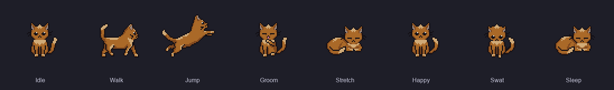

# MeteoPlaneRadar (Tactical & Precipitation Weather Radar for ESP32-S3)


**Multifunctional weather station, live ADS-B flight radar, animated precipitation radar (SHMÚ, ČHMÚ, RainViewer), combined tactical radar, ISS orbit tracking, YouTube channel analytics, financial market tickers, and an animated virtual pet companion on a round 2.1" IPS touchscreen.**  
Designed for the **Waveshare ESP32-S3-Touch-LCD-2.1** with smartphone-like touch gestures, a pull-down Control Center, live aircraft photos, bilinear radar smoothing, and a responsive web dashboard.

> 🇸🇰 Slovenská dokumentácia: **[README_SK.md](README_SK.md)**  
> 🔄 Forked and significantly enhanced from **[petus/MeteoPlaneRadar](https://github.com/petus/MeteoPlaneRadar)**.

*If you enjoy this project, please consider supporting its development!* ☕  
<a href="https://buymeacoffee.com/hackra" target="_blank"></a>

---

## 📸 Live Device Demo

<p align="center">
  
  
  
  
  
  
</p>

### 🐱 DigiCat — Animated Virtual Pet Companion

<p align="center">
  
</p>

<p align="center">
  <em>DigiCat v2.0.9 — Professional 64×64 ginger cat sprites (247 frames, 38 animation sequences, RGB565 PROGMEM, rendered at 3× scale / 192×192 px).</em>
</p>

---

## 🌟 Features

### 🕒 Clock Faces & Time
6 selectable watchfaces (Stacked Bold, Aviator, Orbital, Régulateur, Nordic Minimal, Classic Digital) with forecast pills, moon phase, and a 24-hour solar arc. **7 seconds ring styles**: Off, Dot, Smooth Arc, Pulse, Radar Sweep, Swiss Ticks, Orbital Satellite.

### 🛩️ Aircraft Tracking & Alert HUD
- **360° radar** (14–200 km) via adsb.fi / adsb.lol with range rings and airport beacons.
- **Special flight detection**: Rescue (green), VIP/Government (gold), Heavy jets (cyan), Military (red) — glowing target rings and top alert banner.
- **Emergency squawk auto-focus** (7500/7600/7700): locks onto aircraft, dims all others, shows live telemetry banner.
- **Proximity vector** to nearest aircraft with distance, bearing, and altitude delta.
- **Offline route database**: callsign → origin/destination decoding (e.g., `BOJ→WAW`).
- **Tap any aircraft** for a full telemetry card with live high-res photo from Planespotters.net.

### 🌧️ Precipitation Radar & Nowcasting
- Animated radar loops (SHMÚ / ČHMÚ / RainViewer) with temporal cross-dissolve and optional bilinear smoothing.
- **TREC 2D nowcasting**: alerts only when rain is genuinely heading toward your location (ETA ≤ 35 min, miss ≤ 6 km).
- **Auto precipitation typing**: Rain / Sleet (1–3°C) / Snow (≤1°C) / Hail (>50 dBZ).

### 🛰️ Tactical Radar, ISS, YouTube & Finance
- **Combined Tactical Radar**: precipitation radar + ADS-B flights on one screen simultaneously.
- **ISS Orbit Tracker**: world map with solar terminator, past/future orbits, footprint ring, next-pass countdown, and sonar ping on entry.
- **YouTube Analytics**: live subscriber count, total views, and latest video stats (YouTube Data API v3).
- **Financial Markets**: 4 configurable tickers (ETFs, stocks, crypto, forex) with sparkline and candlestick charts (Yahoo Finance v8).

### 🌤️ Weather, Air Quality & Night Mode
- Hourly temperature, wind, and rain curves, 3-day forecast, AQI, PM2.5, and pollen (Open-Meteo).
- **Deep-Red Night Mode** (0.5% backlight) and `nightClockOnly` mode (locks to clock face during sleep hours).

### 🐾 DigiCat Virtual Pet (v2.0.9)
Full-screen interactive companion (Swipe Up from any screen or Quick Control Center paw icon).

- **247 frames · 38 animation sequences** — professional 64×64 RGBA ginger cat sprites, RGB565 PROGMEM, rendered at **3× scale (192×192 px)**.
- **Rich idle personality (9 sub-animations)**: tail-wag sit, lick paw sitting, lick paw lying, meow sitting/lying/standing, scratch left/right ear, yawn — randomly cycled every 4–10 s.
- **Happy reaction (3 variants)**: sitting, standing-front, standing-right tail-wag — cycling every 1.5–4 s.
- **Aircraft swat (3 variants)**: standing swipe, sitting right paw, sitting left paw — rolled each encounter.
- **5 randomised sleep poses** (Rows 45–56): variant + left/right orientation locked for the entire night.
- **Direction-aware locomotion**: authentic `cat_run_left` when entering from the right; `cat_slide_left` when tilting left.
- **Live weather accessories**: umbrella (rain/storm), knit scarf (snow/cold ≤2°C), aviator goggles (clear).
- **Weather-reactive runway**: dry asphalt / wet reflection / snow dusting.
- **Autonomous AI brain**: random entrances, patrol strolls, pounces, grooming, stretches, and off-screen airfield excursions every 6–12 s.
- **Live aircraft interaction**: jet glides overhead with contrails & strobes → DigiCat sprints and swats; jet hops evasively; DigiCat jumps in pursuit.
- **Night behavior**: 2-min wake window on interaction; yawn → stretch → sleep wind-down; tap to wake.
- **Virtual pet stats**: Happiness & Hunger (0–100%); aviation XP rank (*Kitten Cadet → Radar Navigator → Airspace Ace*).
- **Google Gemini Live AI**: optional Gemini Flash integration for live air traffic commentary (100% offline fallback, SK/CZ/EN).

### ⚡ System & Connectivity
- **Dual-Core FreeRTOS**: Core 1 for ST7701 RGB rendering (double-framebuffer, zero flicker) + touch; Core 0 for network, radar caching, ADS-B parsing.
- **Zero-Drift ST7701 driver**: calibrated 8 MHz RGB clock, no SPI Flash writes during carousel, VSYNC auto-recovery.
- **Hardware RTC** (PCF85063) with optional supercapacitor backup (3.3 V, 1.0–1.5 F).
- **Web dashboard**: configuration, OTA, live serial monitor (64 KB PSRAM ring buffer), screenshot capture, remote screen control.
- **Smart Home REST API**: `/api/status`, `/api/screen`, `/api/display/resync`, `/api/toggle-legends`, `/api/rtc/sync_ntp`.
- **Active buzzer**: emergency squawk alerts, storm warnings, ISS sonar ping, hourly chimes, night muting.

---

## 📱 Screen Overview

| Screen | Preview | Description | Source |
| :--- | :---: | :--- | :--- |
| **0. Clock** |  | 6 watchfaces, forecast pills, moon phase, solar arc | Open-Meteo |
| **1. Planes** |  | 360° ADS-B radar, emergency squawks, routes, airports | adsb.fi / adsb.lol |
| **1b. Aircraft Detail** |  | Full telemetry + live photo on tap | Planespotters.net |
| **2. Weather Radar** |  | Animated radar loop, cross-dissolve, bilinear smoothing | SHMÚ / ČHMÚ / RainViewer |
| **3. Tactical Radar** |  | Precipitation radar + live ADS-B overlay | SHMÚ / ČHMÚ + adsb.fi |
| **4. Forecast** |  | Hourly curves, 3-day forecast, AQI, PM2.5, pollen | Open-Meteo |
| **5. Markets & Crypto** |  | 4 custom tickers, sparkline & candlestick charts | Yahoo Finance v8 |
| **6. ISS Tracker** |  | World map, terminator, orbits, footprint, countdown | WhereTheISS API |
| **7. YouTube** |  | Subscriber count, total views, latest video stats | YouTube Data API v3 |
| **8. Flight Stats** |  | 24h airspace activity across 6 zoom scopes | PSRAM Tracker |
| **9. Settings** |  | Device telemetry, IP, brightness, language, radar config | System |

---

## 🖐️ Gestures & Touch Controls

| Gesture | Action |
| :--- | :--- |
| **Swipe Left / Right** | Previous / next screen |
| **Pull Down from top edge** | Quick Control Center (brightness, night mode, toggles) |
| **Swipe Up from bottom edge** | DigiCat companion drawer |
| **Tap pet** | Pet / affection (purr, blush, dialogue) |
| **Double-tap pet** | Feed treat (restores hunger & happiness) |
| **Swipe Up/Down (center)** | Clock: cycle watchface · Radars: zoom in/out |
| **Tap bottom range bar** | Left = zoom out · Right = zoom in |
| **Tap aircraft** | Open telemetry detail card with live photo |
| **Tap aircraft photo** | Full-screen photo (tap to return) |
| **Double-tap (knock)** | Radars: toggle clean map mode · Finance/ISS: force refresh |
| **Hold BOOT button ~3 s** | Factory reset (clears Wi-Fi & NVS) |

---

## 🔧 Hardware Specifications

Built for the **[Waveshare ESP32-S3-Touch-LCD-2.1](https://www.waveshare.com/esp32-s3-touch-lcd-2.1.htm)**:

| Component | Specification |
| :--- | :--- |
| **MCU** | ESP32-S3R8 · Dual-Core LX7 @ 240 MHz |
| **Memory** | 8 MB Octal PSRAM + 16 MB Quad SPI Flash |
| **Display** | Round 2.1" IPS · 480×480 px · ST7701 RGB |
| **Touch** | CST820 / CHSC6540 Capacitive (I2C) |
| **IMU** | QMI8658 6-axis Accel + Gyro |
| **RTC** | PCF85063 (I2C `0x51`) |
| **Connectivity** | USB-C · Wi-Fi 802.11 b/g/n 2.4 GHz |

---

## 🚀 Installation

### Method A — Pre-built Binary (Easiest)
Download from **[Releases](https://github.com/hackra76/ESP-MeteoPlaneRadar/releases)**:
- `MeteoPlaneRadar-v2.0.9-factory.bin` — full image (bootloader + partitions + firmware).
- Flash via [ESP Web Flasher](https://espressif.github.io/esptool-js/) at 921600 baud, address `0x00000000`.
- Or: `esptool.py -p COM_PORT -b 921600 write_flash 0x0 MeteoPlaneRadar-v2.0.9-factory.bin`

### Method B — PlatformIO
```bash
pio run            # build
pio run -t upload  # flash
```

### First Boot & Wi-Fi Setup
1. Device creates open AP **`MeteoPlaneRadar`** and shows QR code on screen.
2. Connect → open `http://192.168.4.1/` → enter home Wi-Fi credentials → Save.
3. Web dashboard at **`http://meteoplaneradar.local/`** (or device IP).

---

## 🔑 YouTube Data API Key Setup

1. Create a project at [Google Cloud Console](https://console.cloud.google.com/).
2. Enable **YouTube Data API v3** and create an **API Key** (APIs & Services → Credentials).
3. In the device web dashboard → **YouTube** tab → paste key + channel handle (`@name`) or Channel ID (`UC...`).

---

## 🌐 REST API

| Endpoint | Method | Description |
| :--- | :---: | :--- |
| `/api/status` | GET | Full JSON status (weather, aircraft, heap, ISS) |
| `/api/hardware` | GET | Peripherals, RTC, I2C scan, reset reason |
| `/api/screen` | POST | Switch screen `{"index": 0}` (0–9) |
| `/api/display/resync` | POST | Force display hardware resync |
| `/api/toggle-legends` | POST | Toggle clean map mode |
| `/api/rtc/sync_ntp` | POST | Force NTP → RTC sync |

---

## 📜 License & Credits

MIT License.
- Base project: **[petus/MeteoPlaneRadar](https://github.com/petus/MeteoPlaneRadar)**
- DigiCat virtual pet mechanics: **[aquascape123/digicat](https://github.com/aquascape123/digicat)** (MIT)
- Enhancements, SHMÚ radar, ISS tracker, watchfaces, touch navigation, DigiCat hi-res sprites, AI pet brain, web dashboard, Slovak localization: **Rado & Antigravity AI**
