# MeteoPlaneRadar (Tactical & Precipitation Weather Radar for ESP32-S3)


**Multifunctional weather station, live ADS-B flight radar, animated precipitation radar (SHMÚ, ČHMÚ, RainViewer), combined tactical radar, ISS orbit tracking, YouTube channel analytics, financial market tickers, and an animated virtual pet companion on a round 2.1" IPS touchscreen.**  
Designed for the **Waveshare ESP32-S3-Touch-LCD-2.1** with smartphone-like touch gestures, a pull-down Control Center, live aircraft photos, bilinear radar smoothing, and a responsive web dashboard.

> 🇸🇰 Slovenská dokumentácia: **[README_SK.md](README_SK.md)**  
> 🔄 Forked and significantly enhanced from **[petus/MeteoPlaneRadar](https://github.com/petus/MeteoPlaneRadar)**.

*If you enjoy this project, please consider supporting its development!* ☕  
<a href="https://buymeacoffee.com/hackra" target="_blank"></a>

---

## 📸 Live Device Demo

<p align="center">
  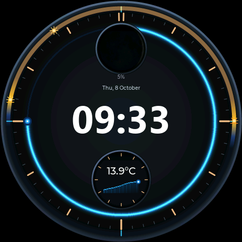
  
  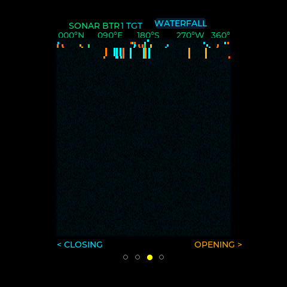
  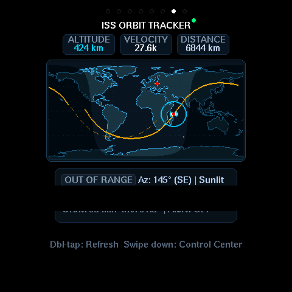
  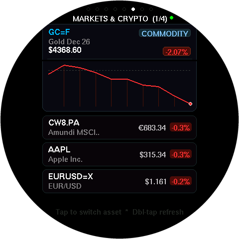
  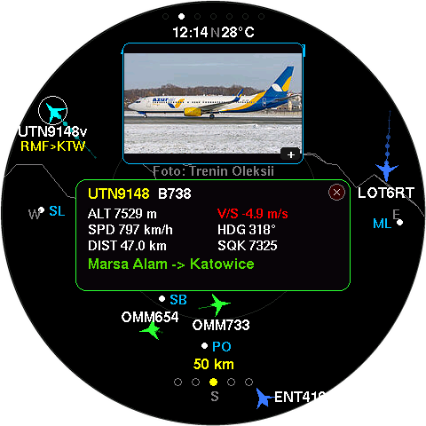
</p>

### 🐱 DigiCat — Animated Virtual Pet Companion

<p align="center">
  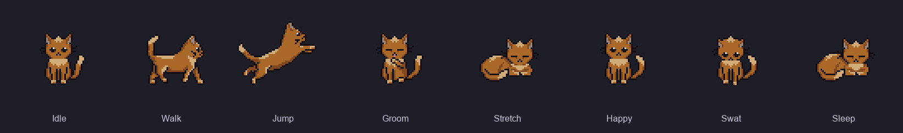
</p>

<p align="center">
  <em>DigiCat v3.0.0 — Professional 64×64 ginger cat sprites (247 frames, 38 animation sequences, RGB565 PROGMEM, rendered at 3× scale / 192×192 px).</em>
</p>

---

## 🌟 Features

### 🚀 v3.0.0 Major Architectural Upgrade
- **LVGL 9 Rendering Pipeline:** Replaced legacy Arduino_GFX rendering with double-buffered LVGL 9.1 (2× 480×480 in PSRAM) and DMA transfers, achieving buttery smooth animations and native anti-aliasing.
- **Luxury Astronomical Chronograph:** Handcrafted Swiss luxury watchface featuring a 24-hour solar twilight perimeter arc with orbiting Sun glyph and golden hour bands, photorealistic 3D raymarched lunar sphere with embedded NASA LROC albedo texture, outdoor temperature trend sparkline subdial, and an orbiting 30 FPS electric-blue seconds bead with Gaussian bloom arc.
- **Glass Cockpit Avionics & Radar Modernization:** 360-degree aviation compass rose bezel, forward 1-minute velocity vector leader lines, selectable target styles (aerodynamic vector chevrons vs. silhouettes), floating uncluttered stacked avionics callouts (with smart origin/destination route substitution), and metric/aviation unit scaling.
- **Multi-Provider Map Underlays:** Switch seamlessly between offline high-speed vector European borders & cities (`EuBorder`) and online raster map tiles (Esri World Dark Gray Canvas, OpenStreetMap Standard) cached to flash memory.
- **Tactical Sonar Screen:** Cold War tactical phosphor green CRT radar sweep (25 FPS) with analog phosphor persistence decay, Doppler velocity color encoding (Closing cyan, Opening amber, Cross-track green), acoustic ping on target contact, and 3 view modes (Classic PPI sweep, Split view with BTR waterfall spectrogram, Full-height Waterfall).
- **3D Orbital Space Command ISS Tracker:** Real-time 3D orthographic spherical Earth projection with Rayleigh atmospheric limb scattering halo, real-time Day/Night solar terminator shading, orbital ground track and radio footprint circle, and 3 view modes (3D ISS, 3D Home, 2D Map).
- **DigiCat 2.0 Aero-Cat Flight Deck Co-Pilot:** Top Gun tactical military intercept mode with aviator sunglasses, animated mini radar scope, real-time 6-axis IMU attitude telemetry (pitch, roll, gyro heading), and Google Gemini AI thoughts.
- **Auto-Hiding Floating Translucent Zoom Controls:** Circular glass `+` and `-` buttons that appear on right-edge touch and auto-hide after 3.5s, eliminating accidental zoom during swipes.
- **Quick Control Center:** Drop-down panel accessible by swiping down from the top edge with direct toggles for brightness, sound/buzzer, flight trails, target styles, map provider, sonar ping, and DigiCat launcher.
- **Zero PSRAM Fragmentation:** Dynamic on-the-fly row downsampling capping buffer to 307KB per frame, preventing memory fragmentation and crashes during wide SHMÚ/ČHMÚ radar playback.

### 🕒 Luxury Astronomical Chronograph
- **24-Hour Solar Twilight Arc:** Outer perimeter ring displaying real-time solar progression (Noon at 12 o'clock, Midnight at 6 o'clock), astronomical sunrise and sunset markers, 24K gold morning/evening golden hour bands, and a dynamic Sun glyph orbiting in real-time according to local solar time.
- **Photorealistic 3D Moon Phase Aperture:** Top complication featuring an embedded 92×92 photographic NASA LROC lunar albedo texture rendered with analytical 3D Lambertian diffuse lighting, limb darkening, smooth phase terminator shadow, and real-time illumination percentage.
- **Temperature Trend Subdial:** Bottom complication with 12 rose-gold radial hour ticks, outdoor temperature, and an electric-blue area sparkline trend curve with glowing end bead. Tap jumps directly to the 3-day weather forecast.
- **Dynamic Seconds Orbit & Bloom:** Electric-blue concentric ring with smooth orbiting luminous seconds bead (~30 FPS) leaving an active Gaussian bloom arc trailing from 12 o'clock to the current second.
- **Swiss Anti-Aliased Typography:** Clean white 76px digital clock digits (HH:MM) with supersampled anti-aliased bezels and a localized date complication.
- **Interactive Alert Banners:** Floating overhead flight banner and approaching precipitation banner with tap-to-inspect navigation.

### 🛩️ Aircraft Tracking & Glass Cockpit Radar
- **360° radar** (14–200 km) via adsb.fi / adsb.lol with range rings, airport beacons, and 360° aviation compass rose bezel.
- **Target blip styling**: Choose between Glass Cockpit aerodynamic vector chevrons (with combat jet double-chevrons) and aircraft silhouettes.
- **Forward velocity vectors**: 1-minute forward ground track leader lines with speed indicator pip.
- **Stacked avionics callouts**: 3-line floating data tags (Callsign or ORIG>DEST, Altitude & vertical rate trend, Ground speed & route) with decluttered spacing and metric/aviation units toggle.
- **Special flight detection**: Rescue (green), VIP/Government (gold), Heavy jets (cyan), Military (red) — glowing target rings and top alert banner.
- **Emergency squawk auto-focus** (7500/7600/7700): locks onto aircraft, dims all others, shows live telemetry banner.
- **Proximity vector** to nearest aircraft with distance, bearing, and altitude delta.
- **Offline route database**: callsign → origin/destination decoding (e.g., `BOJ→WAW`).
- **Aero Glass Flight Deck HUD**: Tap any aircraft for a full telemetry card with live photo from Planespotters.net; tap photo for an aspect-fit, edge-to-edge Aero Glass HUD with zero truncation and live avionics telemetry overlay.

### 🌧️ Precipitation Radar & Nowcasting
- Animated radar loops (SHMÚ / ČHMÚ / RainViewer) with temporal cross-dissolve, isotropic circular masking, and zero-fragmentation row downsampling.
- **TREC 2D nowcasting**: alerts only when rain is genuinely heading toward your location (ETA ≤ 35 min, miss ≤ 6 km).
- **Auto precipitation typing**: Rain / Sleet (1–3°C) / Snow (≤1°C) / Hail (>50 dBZ).

### 🛰️ Tactical Radar, Sonar, ISS, YouTube & Finance
- **Combined Tactical Radar**: precipitation radar + ADS-B flights on one screen simultaneously with glass cockpit avionics.
- **Tactical Acoustic Sonar**: 25 FPS CRT phosphor sweep, BTR waterfall spectrogram history, Doppler velocity encoding, and acoustic contact ping.
- **3D ISS Orbit Tracker**: 3D orthographic Earth globe with atmospheric Rayleigh limb halo, solar terminator Day/Night shading, orbital tracks, and 3 view modes (3D ISS, 3D Home, 2D Map).
- **YouTube Analytics**: live subscriber count, total views, and latest / top video stats (YouTube Data API v3).
- **Financial Markets**: up to 8 configurable tickers (ETFs, stocks, crypto, forex) with sparkline and candlestick charts (Yahoo Finance v8).

### 🌤️ Weather, Air Quality & Night Mode
- Hourly temperature, wind, and rain curves, 3-day forecast, AQI, PM2.5, and pollen (Open-Meteo).
- **Deep-Red Night Mode** (0.5% backlight) and `nightClockOnly` mode (locks to clock face during sleep hours).

### 🐾 DigiCat Virtual Pet (v3.0.0)
Full-screen interactive companion (Swipe Up from bottom edge or Quick Control Center paw icon).

- **247 frames · 38 animation sequences** — professional 64×64 RGBA ginger cat sprites, RGB565 PROGMEM, rendered at **3× scale (192×192 px)**.
- **Aero-Cat Co-Pilot**: Top Gun military intercept mode with gold aviator sunglasses, animated mini radar scope, and live 6-axis IMU attitude telemetry (PITCH, ROLL, GYRO HEADING).
- **Rich idle personality (9 sub-animations)**: tail-wag sit, lick paw sitting, lick paw lying, meow sitting/lying/standing, scratch left/right ear, yawn — randomly cycled every 4–10 s.
- **Happy reaction (3 variants)**: sitting, standing-front, standing-right tail-wag — cycling every 1.5–4 s.
- **Aircraft swat (3 variants)**: standing swipe, sitting right paw, sitting left paw — rolled each encounter.
- **5 randomised sleep poses**: variant + left/right orientation locked for the entire night.
- **Direction-aware locomotion**: authentic `cat_run_left` when entering from the right; `cat_slide_left` when tilting left.
- **Live weather accessories**: umbrella (rain/storm), knit scarf (snow/cold ≤2°C), aviator goggles (clear).
- **Weather-reactive runway**: dry asphalt / wet reflection / snow dusting.
- **Autonomous AI brain**: random entrances, patrol strolls, pounces, grooming, stretches, and off-screen airfield excursions every 6–12 s.
- **Live aircraft interaction**: jet glides overhead with contrails & strobes → DigiCat sprints and swats; jet hops evasively; DigiCat jumps in pursuit.
- **Night behavior**: 2-min wake window on interaction; yawn → stretch → sleep wind-down; tap to wake.
- **Virtual pet stats**: Happiness & Hunger (0–100%); aviation XP rank (*Kitten Cadet → Radar Navigator → Airspace Ace*).
- **Google Gemini Live AI**: optional Gemini Flash integration for live air traffic commentary (100% offline fallback, SK/CZ/EN).

### ⚡ System & Connectivity
- **Dual-Core FreeRTOS**: Core 1 for LVGL 9 RGB rendering (double-framebuffer, zero flicker) + touch; Core 0 for network, radar caching, ADS-B parsing.
- **Zero-Drift ST7701 driver**: calibrated 8 MHz RGB clock, no SPI Flash writes during carousel, VSYNC auto-recovery.
- **Hardware RTC** (PCF85063) with optional supercapacitor backup (3.3 V, 1.0–1.5 F).
- **Web dashboard**: configuration, OTA, live serial monitor (64 KB PSRAM ring buffer), interactive virtual device mirror with touch simulation, remote screen control.
- **Smart Home REST API**: `/api/status`, `/api/screen`, `/api/display/resync`, `/api/toggle-legends`, `/api/rtc/sync_ntp`.
- **Active buzzer**: emergency squawk alerts, storm warnings, ISS sonar ping, acoustic sweep ping, hourly chimes, night muting.

---

## 📱 Screen Overview

| Screen | Preview | Description | Source |
| :--- | :---: | :--- | :--- |
| **0. Clock** |  | Luxury Astronomical Chronograph (24h solar arc, 3D moon, temp sparkline) | Open-Meteo |
| **1. Planes** | 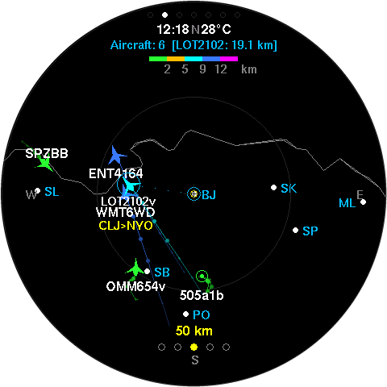 | Glass Cockpit ADS-B radar, 360° compass rose, velocity vectors, map tiles | adsb.fi / adsb.lol |
| **1b. Aircraft Detail** |  | Aero Glass Flight Deck HUD with full telemetry + live photo on tap | Planespotters.net |
| **2. Weather Radar** |  | Animated radar loop, downsampled memory-safe decoding, rain nowcasting | SHMÚ / ČHMÚ / RainViewer |
| **3. Tactical Radar** |  | Precipitation radar + live ADS-B overlay with glass cockpit styling | SHMÚ / ČHMÚ + adsb.fi |
| **4. Sonar** |  | CRT phosphor radar sweep, BTR waterfall spectrogram, Doppler velocity, acoustic ping | adsb.fi |
| **5. Forecast** | 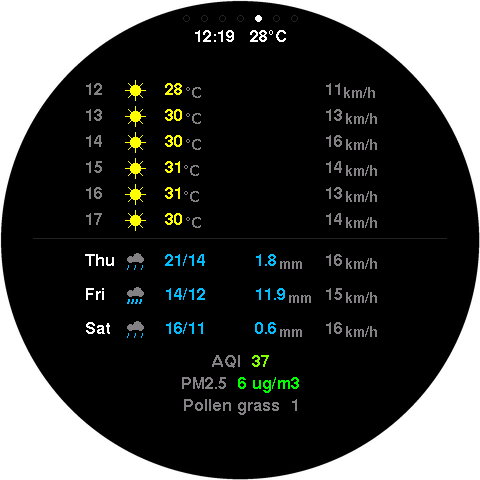 | Hourly curves, 3-day forecast, AQI, PM2.5, pollen | Open-Meteo |
| **6. Markets & Crypto** |  | Up to 8 custom tickers, sparkline & candlestick charts | Yahoo Finance v8 |
| **7. ISS Tracker** |  | 3D orthographic Earth globe, solar terminator, Rayleigh limb glow, orbits | WhereTheISS API |
| **8. YouTube** | 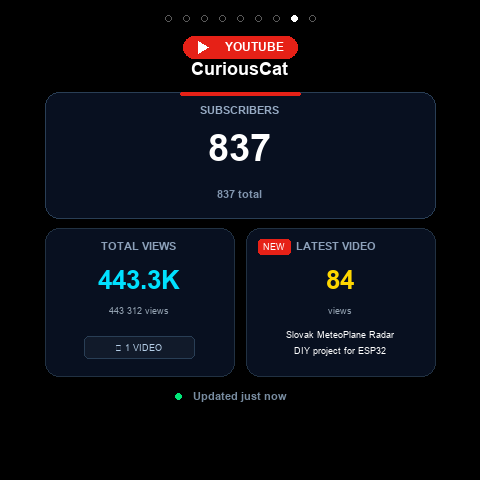 | Subscriber count, total views, latest / top video stats | YouTube Data API v3 |
| **9. Flight Stats & Info** | 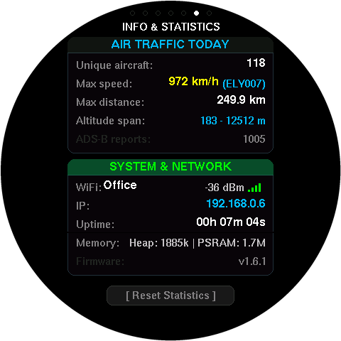 | 24h airspace activity across 6 zoom scopes, internal SRAM & PSRAM telemetry | PSRAM Tracker |
| **10. Settings** | 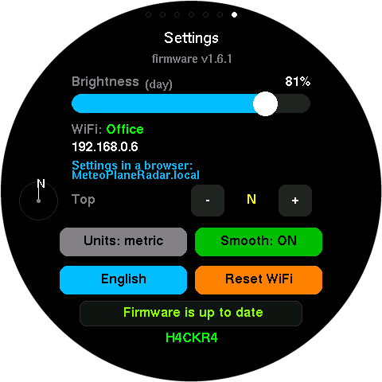 | Device telemetry, IP, brightness, language, map provider, audio, OTA | System |

---

## 🖐️ Gestures & Touch Controls

| Gesture | Action |
| :--- | :--- |
| **Swipe Left / Right** | Previous / next screen |
| **Pull Down from top edge** | Quick Control Center (brightness, night mode, trails, blip style, map provider) |
| **Swipe Up from bottom edge** | DigiCat companion drawer |
| **Tap right flank zone (Radars)** | Reveal floating translucent `+` / `-` zoom buttons (auto-hide after 3.5s) |
| **Tap `+` / `-` zoom buttons** | Zoom in / zoom out radar range |
| **Tap bottom subdial (Clock)** | Jump directly to Weather Forecast screen |
| **Tap alert banner (Clock)** | Jump to Planes (overhead flight) or Weather Radar (rain alert) |
| **Tap aircraft blip** | Open telemetry detail card with live photo |
| **Tap aircraft photo** | Open full-screen Aero Glass Flight Deck HUD (tap to return) |
| **Double-tap screen (Radars)** | Toggle clean map mode (hide / show legends & labels) |
| **Tap top-right badge (Sonar)** | Cycle sonar view mode (Classic PPI → Split → Waterfall) |
| **Tap bottom range pill (Sonar)** | Cycle sonar range (25, 50, 100, 150 km) |
| **Tap Earth globe (ISS)** | Cycle ISS view mode (3D ISS → 3D Home → 2D Map) |
| **Tap pet (DigiCat)** | Pet / affection (purr, blush, dialogue); tap forehead to toggle Top Gun mode |
| **Double-tap pet** | Feed treat (restores hunger & happiness) |
| **Hold BOOT button ~3 s** | Factory reset (clears Wi-Fi & NVS) |

---

## 🔧 Hardware Specifications

Built for the **[Waveshare ESP32-S3-Touch-LCD-2.1](https://www.waveshare.com/esp32-s3-touch-lcd-2.1.htm)**:

| Component | Specification |
| :--- | :--- |
| **MCU** | ESP32-S3R8 · Dual-Core LX7 @ 240 MHz |
| **Memory** | 8 MB Octal PSRAM + 16 MB Quad SPI Flash |
| **Display** | Round 2.1" IPS · 480×480 px · ST7701 RGB |
| **Touch** | CST820 / CHSC6540 Capacitive (I2C) |
| **IMU** | QMI8658 6-axis Accel + Gyro |
| **RTC** | PCF85063 (I2C `0x51`) |
| **Connectivity** | USB-C · Wi-Fi 802.11 b/g/n 2.4 GHz |

---

## 🚀 Installation

### Method A — Pre-built Binary (Easiest)
Download from **[Releases](https://github.com/hackra76/ESP-MeteoPlaneRadar/releases)**:
- `MeteoPlaneRadar-v3.0.0-factory.bin` — full image (bootloader + partitions + firmware).
- Flash via [ESP Web Flasher](https://espressif.github.io/esptool-js/) at 921600 baud, address `0x00000000`.
- Or: `esptool.py -p COM_PORT -b 921600 write_flash 0x0 MeteoPlaneRadar-v3.0.0-factory.bin`

### Method B — PlatformIO
```bash
pio run            # build
pio run -t upload  # flash
```

### First Boot & Wi-Fi Setup
1. Device creates open AP **`MeteoPlaneRadar`** and shows QR code on screen.
2. Connect → open `http://192.168.4.1/` → enter home Wi-Fi credentials → Save.
3. Web dashboard at **`http://meteoplaneradar.local/`** (or device IP).

---

## 🔑 YouTube Data API Key Setup

1. Create a project at [Google Cloud Console](https://console.cloud.google.com/).
2. Enable **YouTube Data API v3** and create an **API Key** (APIs & Services → Credentials).
3. In the device web dashboard → **YouTube** tab → paste key + channel handle (`@name`) or Channel ID (`UC...`).

---

## 🌐 REST API

| Endpoint | Method | Description |
| :--- | :---: | :--- |
| `/api/status` | GET | Full JSON status (weather, aircraft, heap, ISS) |
| `/api/hardware` | GET | Peripherals, RTC, I2C scan, reset reason |
| `/api/screen` | POST | Switch screen `{"index": 0}` (0–10) |
| `/api/display/resync` | POST | Force display hardware resync |
| `/api/toggle-legends` | POST | Toggle clean map mode |
| `/api/rtc/sync_ntp` | POST | Force NTP → RTC sync |

---

## 📜 License & Credits

MIT License.
- Base project: **[petus/MeteoPlaneRadar](https://github.com/petus/MeteoPlaneRadar)**
- DigiCat virtual pet mechanics: **[aquascape123/digicat](https://github.com/aquascape123/digicat)** (MIT)
- Enhancements, SHMÚ radar, ISS tracker, watchfaces, touch navigation, DigiCat hi-res sprites, AI pet brain, web dashboard, Slovak localization: **Rado & Antigravity AI**
