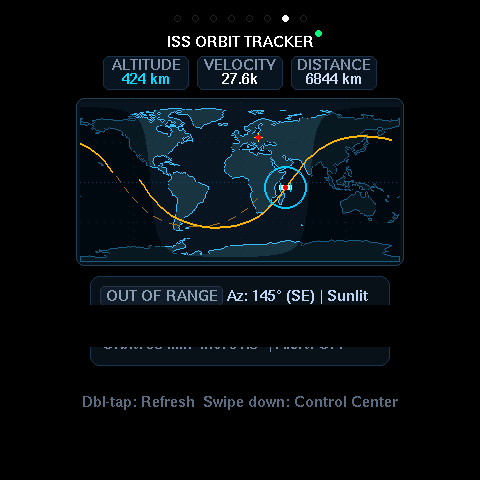
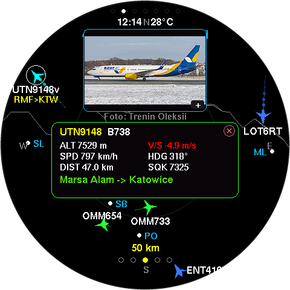
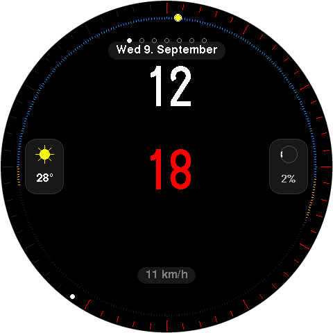
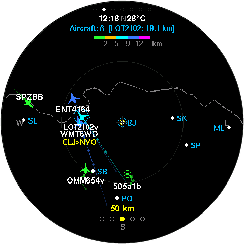
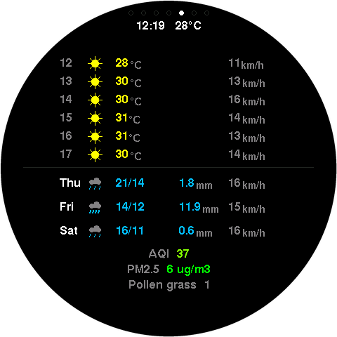
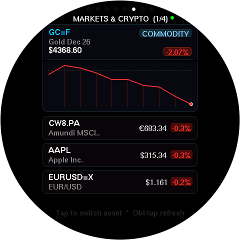
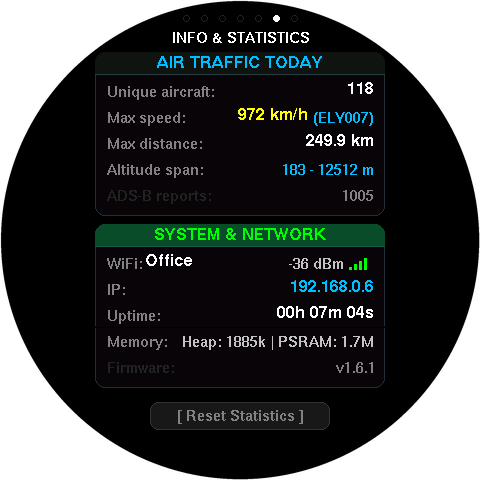
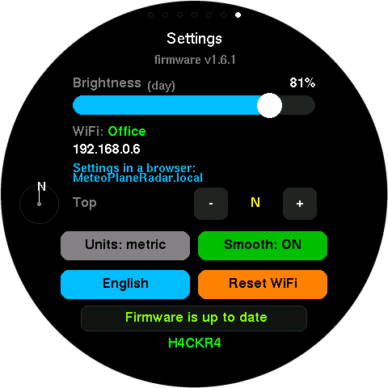

# MeteoPlaneRadar (Taktický a meteorologický radar pre ESP32-S3)


**Multifunkčná meteorologická stanica, živý letecký ADS-B radar, animovaný radar zrážok (SHMÚ, ČHMÚ, RainViewer), kombinovaný taktický radar, sledovanie stanice ISS a dizajnové ciferníky hodín na okrúhlom 2.1" IPS dotykovom displeji.**  
Vyvinuté špeciálne pre vývojovú dosku **Waveshare ESP32-S3-Touch-LCD-2.1** s modernými dotykovými gestami v štýle smartfónu, sťahovacím Ovládacím centrom (Control Center), reálnymi fotografiami lietadiel, bilineárnym vyhladzovaním radaru a responzívnym webovým rozhraním pre diaľkové ovládanie a kompletnú konfiguráciu.

> 🇬🇧 English documentation: **[README.md](README.md)**  
> 📌 Forknuté a výrazne vylepšené z pôvodného projektu **[petus/MeteoPlaneRadar](https://github.com/petus/MeteoPlaneRadar)**.

---

## 📸 Živé ukážky zo zariadenia

<p align="center">
  
  
  
  
  
</p>

<p align="center">
  <em>Zľava doprava: <b>Taktický radar</b>, <b>Sledovanie ISS</b> (solárny terminátor deň/noc, minulá a budúca trajektória, kruh viditeľnosti), <b>Detail lietadla</b>, <b>Meteorologický radar</b>, <b>Ciferník Stacked Bold</b>.</em>
</p>

---

## 🌟 Kľúčové novinky vo verzii v1.9.0

- 🛰️ **Nová obrazovka Sledovanie stanice ISS (`SCREEN_ISS_I`):**
  - Nová vesmírna obrazovka zaradená medzi Trhy & Krypto a Informácie (`Forecast` -> `Markets` -> `ISS` -> `Info`).
  - Globálna mapa sveta (320×160 equirectangular) vycentrovaná v okrúhlom displeji s dynamickým vykresľovaním dňa a noci (astronomický solárny terminátor).
  - Vykreslenie obežnej dráhy ISS: minulá dráha (45 min, bodkovaná čiara) a predpoveď budúcej dráhy (92 min, plná jantárová krivka).
  - Kruh viditeľnosti z paluby stanice (~2 200 km horizon ring), piktogram satelitu a zameriavač domácej polohy.
  - Telemetrický HUD panel: Výška (km), Rýchlosť (tis. km/h) a Šikmá vzdialenosť od pozorovateľa (km).
  - Karta stavu preletu: Indikátor viditeľnosti (`IN RANGE` / `OUT OF RANGE`), Azimut stanice so svetovou stranou, osvetlenie (`Sunlit` / `In Eclipse`), odpočet do najbližšieho preletu a maximálna elevácia.
  - Akustický sonarový ping (`BEEP_SONAR_PING`) pri vstupe stanice do zóny viditeľnosti.
  - Integrácia do Ovládacieho centra: samostatné tlačidlo v sťahovacom menu pre zapnutie/stlmenie zvukového upozornenia; dvojitým ťuknutím okamžitá obnova údajov z API.
- 🌐 **Webová správa a telemetria ISS:**
  - Samostatná karta "🛰️ ISS" so živou telemetrickou tabuľkou údajov.
  - Priamy prepínač obrazovky na displeji a voľba zaradenia do rotácie obrazoviek.

---

## 🌟 Kľúčové novinky vo verzii v1.8.0

- 📈 **Nová obrazovka Trhy, Akcie & Krypto (`SCREEN_FINANCE_I`):**
  - Úplne nová interaktívna obrazovka zaradená medzi Predpoveď počasia a Informácie (`Forecast` -> `Markets` -> `Info`).
  - Sledovanie 4 voliteľných inštrumentov v reálnom čase (akcie, európske ETF ako Amundi MSCI World, Stoxx 600, komodity ako zlato/ropa, kryptomeny a menové páry) cez Yahoo Finance v8 chart API.
  - Interaktívny sparkline graf pre aktívny ticker, farebné indikátory zmeny v percentách a kategóriové štítky (`CRYPTO`, `COMMODITY`, `ETF`, `STOCK`, `FOREX`).
  - Dotykové ovládanie: ťuknutím prepínanie aktívneho grafu, dvojitým ťuknutím okamžitá obnova údajov.
  - Plne asynchrónne sťahovanie na jadre 0 bez vplyvu na plynulosť displeja.
- 🌐 **Webová správa trhových aktív:**
  - Samostatná karta "📈 Trhy & Krypto" s priamym prepínačom na displej a voľbou zaradenia do rotácie obrazoviek.
  - 4 prehľadné riadky na výber tickerov s bohatými predvoľbami (európske ETF, indexy, kovy, krypto).
- 🔧 **Oprava vertikálneho posunu obrazu a časovania ST7701:**
  - Odstránené volanie `LCD_Restart()` pri prechodoch a potiahnutí, čím sa zabránilo rozladeniu interného čítača riadkov radiča ST7701 a trvalému posunu obrazu nahor.
  - Nastavené korektné vertikálne a horizontálne synchronizačné pulzy (`VBP 20`, `VPW 8`, `VFP 10`) podľa špecifikácie displeja.
- 🔄 **Zosúladenie poradia obrazoviek:**
  - Poradie obrazoviek na displeji zodpovedá webovému rozhraniu: Hodiny (0) -> Lietadlá (1) -> Počasie (2) -> Taktický radar (3) -> Predpoveď (4) -> Trhy & Krypto (5) -> Informácie (6) -> Nastavenia (7).

---

## 🌟 Kľúčové novinky vo verzii v1.6.1

- 🔧 **Oprava Planespotters.net API (403 Forbidden):** Aktualizovaná hlavička `User-Agent` s kontaktnou URL na GitHub repozitár, čím sa predišlo blokovaniu Cloudflare firewallom a obnovilo spoľahlivé sťahovanie fotiek lietadiel.
- 🔄 **Správne vyradenie Info obrazovky z cyklovania:** Opravená synchronizácia prepínačov obrazoviek vo webovom rozhraní – odškrtnutie Info obrazovky spoľahlivo zastaví jej automatické striedanie.
- 🎯 **Ukladanie mierky taktického radaru (Tactical Zoom Persistence):** Taktický kombinovaný radar si pamätá nastavenú mierku (`rngT`) aj po reštarte zariadenia.
- 🌐 **Kompletný preklad kódu do angličtiny:** Všetky komentáre a interné debug značky v kóde boli zjednotené do angličtiny a vyčistené od starých artefaktov.

---

## 🌟 Kľúčové novinky vo verzii v1.6.0

- 🌧️ **Detekcia blížiacich sa zrážok & Nowcasting (TREC):** 2D priestorová krížová korelácia analyzuje pohyb zrážkových buniek medzi radarovými snímkami. Upozornenie sa aktivuje **iba a výhradne vtedy, ak zrážky smerujú k vašej polohe** ($v_{radial} > 0$, minutie $\le 15\text{ km}$, $\text{ETA} \le 60\text{ min}$), čím eliminuje plané poplachy pri obchádzaní stanice.
- ❄️ **Klasifikácia typu zrážok:** Automatické rozlíšenie na **Dážď**, **Dážď so snehom** ($1^\circ\text{C}\dots3^\circ\text{C}$), **Sneh** ($\le 1^\circ\text{C}$) alebo **Krúpy** ($>50\text{ dBZ}$) na základe odrazivosti radaru a teploty.
- ✈️ **Denná štatistika letov & Samostatná obrazovka Info (`SCREEN_INFO_I`):** Nová 6. obrazovka v rotačnom cykle sledujúca 24-hodinovú leteckú premávku: počet unikátnych lietadiel za deň, rekordnú rýchlosť s volacím znakom, maximálnu vzdialenosť detekcie, rozpätie výšok a celkový počet správ. Automatický reset o polnoci.
- 🛩️ **Prelet nad hlavou (Overhead Widget & Alert):** Monitorovanie lietadiel vo valcovom priestore priamo nad stanicou s nastaviteľným polomerom (1–50 km, predvolene 10 km) a widgetom na obrazovke hodín.
- 🔊 **Komplexný systém akustických výstrah (Bzučiak):** Vstavaný aktívny bzučiak s tónmi pre núdzový squawk (7700/7600/7500), sledovaný let, prelet nad hlavou, blížiace sa zrážky, pípnutie na celú hodinu, dotykovú odozvu a nočný kľud.
- 🌙 **Ultra Night režim (Hlboká červená):** Monochromatický tmavočervený nočný režim s minimálnym jasom (0.5%), ktorý šetrí nočné videnie a neruší spánok.
- 📸 **Nástroj na zachytenie obrazovky (Screenshot Tool):** Okamžité stiahnutie nekomprimovaného 24-bitového BMP obrázka displeja priamo cez webové rozhranie.
- 🌐 **Sériový monitor výhradne v angličtine & Čisté uvedenie autorov:** Prechod všetkých systémových výpisov na angličtinu a korektné uvedenie pôvodného projektu `petus/MeteoPlaneRadar`.

---

## 🌟 Kľúčové novinky vo verzii v1.5.9

- 🖥️ **Moderné webové rozhranie orientované na obrazovky:** Navigácia webového rozhrania bola kompletne prepracovaná. V riadku pod názvom sa nachádzajú priamo jednotlivé obrazovky zariadenia (**Hodiny**, **Lietadlá**, **Meteoradar**, **Taktický radar**, **Predpoveď**) a ako samostatné posledné tlačidlo **Spoločné nastavenia**.
- ▶ **Priame prepnutie displeja z webu:** Každá obrazovka na webe má vyhradené tlačidlo *▶ Zobraziť na displeji* a prepínač pre zaradenie do automatického cyklu.
- ⚡ **Trvalo viditeľný panel Hardvér & Ovládač:** Hardvérové diagnostické informácie a diaľkový ovládač displeja (vrátane prepínania legiend a zmeny rozsahu radaru) sú teraz trvalo viditeľné nezávisle od zvolenej obrazovky (na desktopoch ako fixný pravý stĺpec).
- 🎨 **Uprataná a zarovnaná hlavička s indikátorom displeja:** Čisté centrovanie názvu, odznaku H4CKR4 a verzie s pulzujúcim indikátorom práve zobrazenej obrazovky na okrúhlom displeji.

---

## 🌟 Kľúčové funkcie a inovácie

### 🕒 1. Bohatá kolekcia 7 unikátnych ciferníkov hodín
Okrúhly 480×480 displej ponúka **7 odlišných geometrických štýlov ciferníka** s okamžitým prepínaním cez web, Ovládacie centrum alebo dvojitým poklepaním na telo prístroja:
1. **Digitálny klasický (Classic Digital)** – čistý horizontálny čas, dátum, počasie, 3-hodinová minipredpoveď, vietor a fáza mesiaca.
2. **Letecký kokpitový analóg (Aviator Cockpit)** – pilotné hodinky s luminiscenčnými ručičkami, hodinovými indexmi a dvoma sub-ciferníkmi.
3. **🚀 Planetárne prstence (Orbital Gauges)** – sci-fi dizajn tvorený tromi sústrednými kruhovými oblúkmi (minúty, hodiny, sekundy) s dorastajúcimi svetelnými perlami.
4. **🛩️ Stíhací priehľadový displej (Fighter HUD)** – Head-Up Display z bojového lietadla s umelým horizontom, zameriavacím krížom (`SYS·TGT·LOCK`), hornou kompasovou páskou a indikátormi vetra.
5. **⏱️ Astronomický regulátor (Régulateur Chrono)** – mechanický observatórny chronometer s oddelenými osami ručičiek.
6. **🔲 Vertikálna typografia (Stacked Bold)** – moderný smartwatch dizajn (Pixel / Nothing) s obrovským dvojčíslom hodín a minút.
7. **Nordic minimalistický (Minimal)** – masívny, vysoko kontrastný čas čitateľný z veľkej diaľky.

### ⏱️ 2. Zobrazenie sekúnd na okrúhlom obvode
Až **7 štýlov sekundového prstenca**:
- `Vypnuté`, `Bodka`, `Plynulý oblúk`, `Pulz`, `Radarový lúč (Sweep)`, `Hodinárske indexy (Ticks)`, `Satelit na orbite (Orbit)`.

### 🛩️ 3. Pokročilé sledovanie letov & Inteligentný Alert HUD
- **Špeciálne kategórie letov:** Záchranári (zelená), vládne lety (zlatá), obrie a ikonické lietadlá (azúrová) a vojenské lety (červená) sú automaticky identifikované a zvýraznené pulzujúcim kruhom.
- **Notifikačný Alert štítok:** Okamžité upozornenie na radare pod časom pri výskyte dôležitého letu (napr. `! Zachranny vrtulnik: ATE02 (18 km) !`).
- **Núdzové lety (Squawk 7500, 7600, 7700):** Automatické uzamknutie a sledovanie lietadla v núdzi so živou telemetriou.
- **Vektor k najbližšiemu lietadlu:** Dynamická čiara ukazujúca smer, vzdialenosť a prevýšenie k najbližšiemu lietadlu.
- **Letiská & Databáza trás:** Zobrazenie letísk v okolí a offline dekódovanie letových trás z volacích znakov (napr. `Burgas -> Warsaw [BOJ>WAW]`).

### 🛰️ 4. Taktický radar (`ScreenTactical`)
Unikátna obrazovka kombinujúca **zrážkový radar (SHMÚ / ČHMÚ / RainViewer) v pozadí** a **letovú prevádzku v reálnom čase v popredí**.

### 🕒 5. Hardware RTC čip (PCF85063) & Časová nezávislosť
- Automatická synchronizácia palubného RTC čipu s internetovým časom.
- Po odpojení od napájania beží čas ďalej (podpora pripojenia 1.0F / 1.5F 3.3V superkondenzátora na piny `BAT` a `GND`).
- Tlačidlá vo webovom rozhraní pre okamžitú synchronizáciu s NTP serverom alebo priamo z hodín prehliadača.

### ⚡ 6. Bezpečná dvojjadrová FreeRTOS architektúra (Dual-Core)
- **Jadro 1 (Core 1):** Vyhradené výhradne pre plynulé vykresľovanie displeja ST7701 (dvojitý framebuffer bez blikania), čítanie dotyku CST820 a detekciu gest z IMU.
- **Jadro 0 (Core 0):** Asynchrónny worker (`AsyncNetWorker`) na pozadí spracováva TLS šifrovanie, sťahuje radarové snímky, komunikuje s ADS-B API a obsluhuje webový server.

---

## 📱 Prehľad obrazoviek

| Obrazovka | Náhľad | Popis | Zdroj dát |
| :--- | :---: | :--- | :--- |
| **1. Hodiny** |  | 7 voliteľných ciferníkov (Stacked Bold, Aviator, HUD atď.), minipredpoveď, počasie, fáza mesiaca, solárny oblúk | Open-Meteo & Astro engine |
| **2. Lietadlá** |  | 360° radar vzdušného priestoru, núdzové kódy (7700/7600), aerolínie a trasy, letiská, vzdialenostné kružnice | adsb.fi / adsb.lol |
| **2b. Detail lietadla** |  | Po kliknutí na lietadlo sa zobrazí kompletná telemetria, trasa odkiaľ-kam a fotografia daného stroja | Planespotters.net API |
| **3. Meteoradar** |  | Animovaná radarová slučka zrážok s plynulým prelínaním, legendou odrazivosti dBZ a mestami | SHMÚ (SK), ČHMÚ (CZ), RainViewer |
| **4. Taktický radar** |  | **Kombinovaný taktický pohľad:** Živá zrážková oblačnosť + prelety lietadiel na jedinej obrazovke | SHMÚ / ČHMÚ / RainViewer + adsb.fi |
| **5. Predpoveď** |  | Hodinové krivky teploty, vetra a zrážok, 3-dňový výhľad, index kvality ovzdušia (AQI), PM2.5 a peľ | Open-Meteo Weather & Air Quality |
| **6. Trhy a Krypto** |  | Živé sledovanie 4 konfigurovateľných trhových tickerov (ETF, akcie, komodity, kryptomeny, forex) so sparkline grafmi | Yahoo Finance v8 |
| **7. Sledovanie dráhy ISS** |  | Globálna mapa sveta s reálnym solárnym terminátorom deň/noc, trajektória obehu, kruh viditeľnosti a odpočet preletu | WhereTheISS API |
| **8. Štatistiky letov** |  | Denná 24h štatistika: počet unikátnych lietadiel, rýchlostný rekord, letové hladiny, max dosah, ADS-B správy | FreeRTOS PSRAM Tracker |
| **9. Nastavenia** |  | Stav zariadenia, IP adresa, regulácia jasu, orientácia mapy, voľba jazyka a vyhladenie | Systém |


---

## 🖐️ Dotykové gestá a ovládanie

| Gesto / Akcia | Funkcia |
| :--- | :--- |
| **Potiahnutie doľava / doprava** | Plynulé prepnutie na nasledujúcu / predchádzajúcu obrazovku s animáciou. |
| **Stiahnutie z horného okraja** | Otvorenie **Rýchleho ovládacieho centra (Control Center)** (jas, nočný režim, prepínače). |
| **Potiahnutie hore / dolu v strede** | **Na radaroch:** Zoom In (hore) / Zoom Out (dolu).<br>**V Ovládacom centre:** Zatvorenie menu. |
| **Dotyk na spodnú lištu rozsahu** | Ľavá polovica oddiali (Zoom Out), pravá polovica priblíži (Zoom In). |
| **Dotyk na lietadlo** | Zobrazenie detailnej karty lietadla s fotkou, trasou a telemetriou. |
| **Dotyk na fotografiu lietadla** | Zväčšenie fotografie na celú obrazovku (opätovné ťuknutie vráti detail). |
| **Dvojité poklepanie (telo / stôl)** | **Na hodinách:** Prepnutie na ďalší ciferník.<br>**Na radaroch:** Čistý režim mapy (skrytie legiend). |
| **Podržanie tlačidla BOOT pri štarte (~3 s)** | Továrenský reset (vymazanie uloženej Wi-Fi a nastavení NVS). |

---

## 🔧 Hardvérové špecifikácie

Vyvinuté špeciálne pre **[Waveshare ESP32-S3-Touch-LCD-2.1](https://www.waveshare.com/esp32-s3-touch-lcd-2.1.htm)**:

| Komponent | Špecifikácia |
| :--- | :--- |
| **MCU** | Espressif ESP32-S3R8 (Xtensa® Dual-Core 32-bit LX7 @ 240 MHz) |
| **Pamäť** | 8 MB Octal PSRAM + 16 MB Quad SPI Flash |
| **Displej** | Okrúhly 2.1" IPS, 480×480 px, 65k RGB565 farieb, ST7701 RGB zbernica |
| **Dotyk** | CST820 / CHSC6540 kapacitný dotykový ovládač (I2C) |
| **I/O Expandér** | TCA9554PWR (riadenie napájania displeja, podsvietenia a resetu) |
| **IMU Senzor** | QMI8658 6-osý akcelerometer a gyroskop (detekcia poklepania a orientácie) |
| **RTC Čip** | PCF85063 hodiny reálneho času so záložným napájaním (I2C `0x51`) |
| **Konektivita** | USB-C, Wi-Fi 802.11 b/g/n (2.4 GHz) |

---

## 🚀 Inštalácia a prvé spustenie

### 1. Zostavenie a nahratie cez PlatformIO
1. Otvorte priečinok projektu vo **Visual Studio Code** s rozšírením **PlatformIO IDE**.
2. Pripojte dosku cez USB-C kábel.
3. Spustite príkazy:
   ```bash
   # Kompilácia firmvéru
   pio run

   # Nahratie do zariadenia
   pio run -t upload
   ```

### 2. Nastavenie Wi-Fi (Captive Portal)
1. Pri prvom štarte zariadenie vytvorí otvorenú Wi-Fi sieť s názvom **`MeteoPlaneRadar`** a zobrazí QR kód.
2. Naskenujte QR kód alebo sa pripojte na sieť `MeteoPlaneRadar` z mobilu/PC.
3. Otvorte adresu **`http://192.168.4.1/`**.
4. Vyberte vašu domácu Wi-Fi sieť, zadajte heslo a uložte.
5. Zariadenie sa pripojí a zobrazí svoju pridelenú IP adresu.

### 3. Webové rozhranie
Po pripojení otvorte prehliadač na adrese:
- **`http://meteoplaneradar.local/`** (alebo cez IP adresu, napr. `http://192.168.0.7/`).

Webové rozhranie ponúka:
- **Lokalita:** Automatická GeoIP detekcia alebo manuálny výber mesta/GPS súradníc.
- **Štýl hodín:** Výber ciferníka, sekundového prstenca a farebných akcentov.
- **Nastavenia radaru:** Voľba poskytovateľa zrážok (SHMÚ / ČHMÚ / RainViewer), vyhladzovanie, zobrazenie letísk a trás.
- **Nočný režim hodín (`nightClockOnly`):** Zastaví cyklické prepínanie obrazoviek v noci a uzamkne stlmený ciferník.
- **Hardvérová diagnostika & Webový sériový monitor:** Vstavaná live konzola sériového monitora cez web (64 KB PSRAM buffer) bez nutnosti USB pripojenia, RTC hodiny a synchronizačné tlačidlá.
- **Diaľkové ovládanie:** Prepínanie obrazoviek a zmena zoomu priamo z prehliadača.
- **OTA Aktualizácia:** Pohodlné nahrávanie nového `.bin` firmvéru vzduchom cez Wi-Fi bez nutnosti pripájať USB kábel.

---

## 📜 Licencia a autori

Vydané pod licenciou **MIT License**.
- Pôvodný základ projektu: **[petus/MeteoPlaneRadar](https://github.com/petus/MeteoPlaneRadar)**.
- Vylepšenia, slovenská lokalizácia, integrácia SHMÚ radaru, bilineárne vyhladzovanie, Planespotters fotografie lietadiel, taktický kombinovaný radar, RTC ovládač, IMU gestá, dotyková navigácia, rýchle Ovládacie centrum, watchlist lietadiel a multi-core optimalizácia: **Rado & Antigravity AI**.
